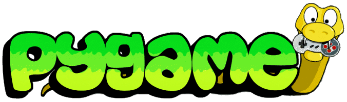

# Learn Pygame with Sandip
## What is pygame
Pygame is a cross-platform set of Python modules designed for writing video games. It includes computer graphics and sound libraries designed to be used with the Python programming language.

## Some useful Resources
- https://realpython.com/pygame-a-primer/
- https://www.pygame.org/
- https://pythonprogramming.net/pygame-python-3-part-1-intro/
- https://www.youtube.com/watch?v=FfWpgLFMI7w
- https://www.youtube.com/watch?v=cJbnWZGX-XY

## About Developer
<a href="https://sandipsadhukhan.tk" target="_blank" >Sandip Sadhukhan</a>
